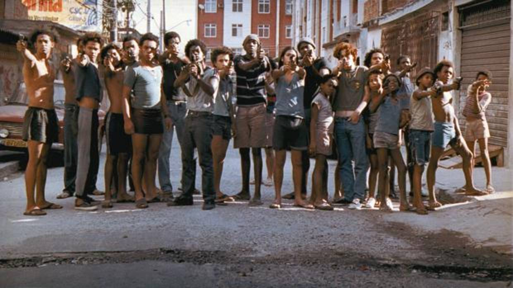

# Ciudad de Dios

Cenoura, Bené, Ze Pequeño, Dadinho, Buscapé, Filé con patatas, Mané Galinha, Neguinho...

Este "menage a trois" entre Godfellas vagabundos, balas de Peckinpah y Manu Chao espídico se ha situado por mérito propio entre las mejores películas de la década, y quién sabe para el futuro... Particularmente pienso que envejecerá bien, pues radica su fuerza en los violentos personajes, y eso nunca pasa de moda, a parte de tener una estructura moderna, no exagerada, basada en parones de cámara, capítulos titulados y viajes en el tiempo por flash backs que se enganchan una y otra vez a la historia.

El ritmo es frenético y antes de querer darte cuenta ya estás enganchado a las desventuras de la favela.

Buenas frases, buen trato a los personajes, buena música, desgarradora, a ratos, fotografía y un frío trato a la realidad, que le permite prescindir de mostrar la moraleja, cosa que yo, personalmente, agradezco enormemente.

Respecto a la polémica de su puesto 20 en el top FA (y llegó a estar entre las diez primeras, creo recordar), ya veremos qué dice el tiempo. Hay que tener en cuenta también que mucha gente ve la peli, le gusta, y en fin, le falta tiempo para conectarse y soltarle un 10. La emoción está reciente, acto que no ocurre igual de exagerado con los grandes clásicos (si mi padre vuelve a ver L'Atalante no sale disparado del salón al ordenador para conectarse a leer como un enfermizo todo lo que se cuente de ello en la Gran Red y ponerse a disparar votos y piropos en foros y páginas de todo tipo donde se mencione "Cidade de Deus".

{: width=100% }
