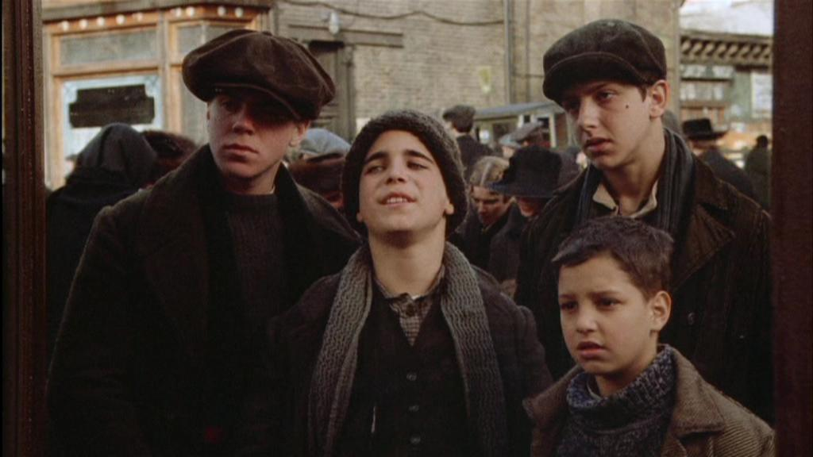

# Érase una vez en América

Insobornablemente fiel a su libreto de estilo, Leone emprende con “Once upon a time in America” su segundo proyecto de despedida u homenaje al cine genuinamente americano. Esta vez situando el marco de acción en la Nueva York de los convulsos años 20 y 30. Quizás, en esta ocasión, el gran Sergio no alcanza por muy poquito la inigualable apoteosis conceptual y artística que había conseguido previamente con “Once upon a time in west”. Tal vez pedirle a Leone tocar el cielo por segunda vez y conseguir que todos los ángeles del firmamento ondeen nuevamente banderas celestiales resulte abusivo. Cuestión de matices. En cualquier caso eso no significa que la peli en cuestión sea floja. Ni mucho menos. Es sublime.

Leone imprime a su trabajo el habitual tono operístico que le caracteriza y que brota de una serie de puntales que siempre le han proporcionado excelentes resultados. El italiano intuye como pocos el efecto estético y emocional de sus movimientos de cámara en el propio espectador y exprime al máximo su rendimiento. No contento con ello, el meticuloso cineasta concede a la puesta en escena la valía que se merece, obteniendo con ello ese empaque lírico que ha forjado su prestigio. Pero eso no es todo. El gran Sergio sabe que esto del cine es un trabajo en equipo y que tanto la música de Ennio Morricone como la fotografía de Tonino Delli Colli son casi siempre garantía de éxito. Por si fuera poco el elenco de estrellas que configuran el reparto es espectacular: Robert de Niro, James Woods, Danny Aiello, Joe Pesci, Elizabeth McGovern, Treat Wiliams, una jovencísima Jennifer Connelly… La obsesión, la efervescencia, la avidez de Sergio no tiene límites. El entusiasmo le empuja a desarrollar, a su ritmo, una hermosísima y melancólica historia de cuatro adolescentes de los suburbios de Manhattan (Noodles, Max, Patsy y Cockeye) que, al abrigo del hampa neoyorquina, llegarán a lo más alto. Sin límite de metraje, por supuesto. Tres horas y media de duración dan fé de ello. No obstante, la peli no aburre en ningún momento. El pulso narrativo es brillante y la trama no decae. Cierto es que las elipsis enriquecen el conjunto y que las contundentes dosis de violencia y sexo que nos suministra Leone nos mantienen enchufados a esta soberbia epopeya de gángsters como perritos falderos pero, insisto, sujetar al espectador inmovilizado en su asiento durante cerca de cuatro horas tiene su mérito. Pocos directores son capaces de manejar semejantes metrajes esquivando el sopor como lo hace el italiano.

{: width=100% }
