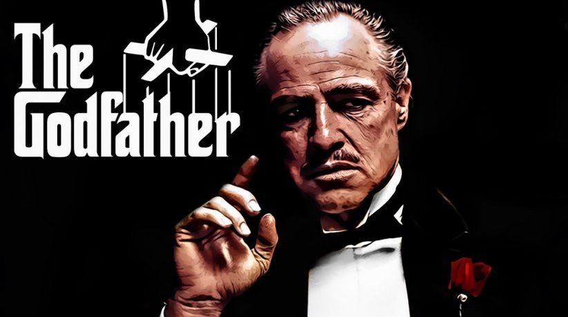

# El Padrino

El efecto que causa en mi "El padrino" es increíble, es la potente sensación de estar degustando auténtico cine desde el primer hasta el último instante... muchos hablan sobre que la secuencia de la boda es larga y algo aburrida, y a mi me parece una presentación de personajes descomunal: Desde Don Vito hasta Johnny son definidos y caracterizados de un modo espectacular, nada chirría, todo tiene su significado, ni un sólo actor desentona, ni un sólo encuadre es desacertado... en definitiva, asistimos a un arranque que te deja suspendido en su historia, en su ambientación y en todos aquellos conflictos presentados de forma absolutamente impecable.

La elegancia y la sinuosidad con que se mueve todo, hacen que cuando llega el auténtico clímax uno esté expectante, palpitante ante esa calma tensa, fría, abrupta, turbia y gradual que se da cita en esos momentos donde todo llega a extremos inhóspitos, donde la venganza permanece como un instinto secundario con tal de proteger y cobijar todo aquello que es propio, que nos acompaña y nos arropa. Y es que, tras un arranque esplendoroso, su desarrollo aun se retuerce más y te envuelve en un relato en el cual los acontecimientos empujan imprevisiblemente a sus protagonistas y les desbordan, les oprimen, les ponen en la punta del iceberg, en una cuerda tensa y fina que, en cualquier momento, podría romperse, temblorosa, y dejarles inmersos en la más absoluta angustia.

Los intérpretes en "El padrino" son anulados, no existen, el personaje se desvanece y deja paso a la persona, a personas que te dejan en el borde del abismo, que marcan tu afán por seguir sus pasos, comprender su inquebrantable honestidad hacía todos aquellos seres a los que aman y aprecian, en definitiva, hacía su propia familia, al lado de la cual han medrado, han aprendido y llegado a ser lo que son, y han pulido sus virtudes y desarrollado sus defectos, virtudes y defectos que se destapan una y otra vez, que aparecen sin reparos, impulsivamente, y que te dejan extasiado y en un estado de cautela sepulcral, que te hace enmudecer y observar en el más absoluto silencio cada gesto, cada mirada, cada movimiento con tal de comprender porqué sucede lo que sucede y cuan intensos pueden llegar a ser los sentimientos de cualquier ser humano.

Hablar sobre planos, fotografía, movimientos de cámara, encuadres, vestuario y demás sería quedarse en la más absoluta nada tras seres que te dejan encogido en la butaca y sin parpadear ni un sólo momento. Y eso que la banda sonora se te queda grabada, porque por mucho que Vito, Sonny, Michael, Tom o Kay capten tu atención del todo, genialidades como la de Nino Rota nunca pasarían desapercibidas. Jamás.

{: width=100% }
